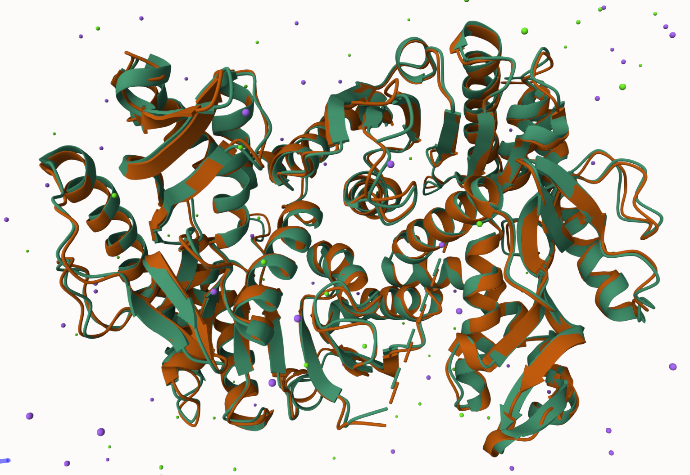
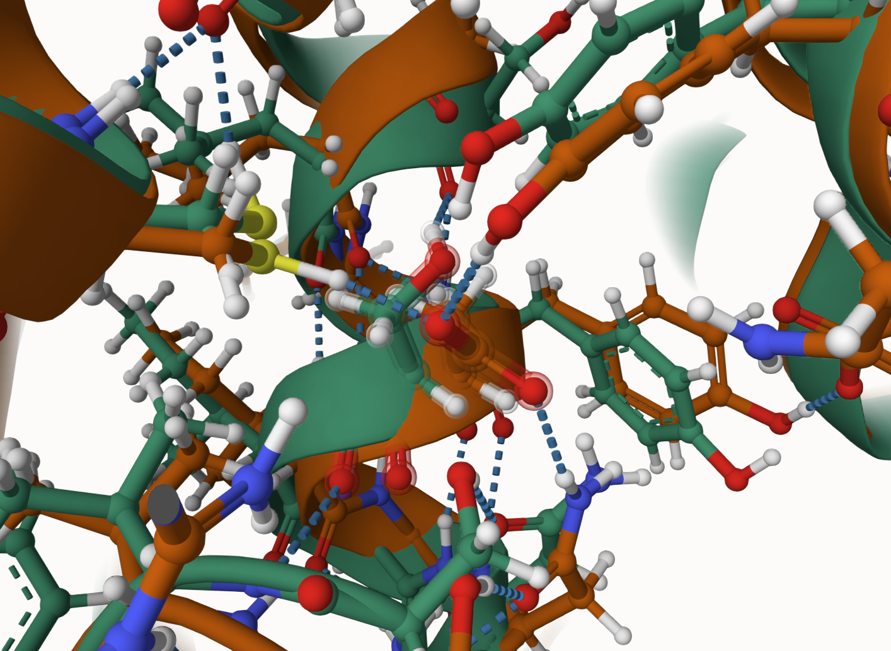
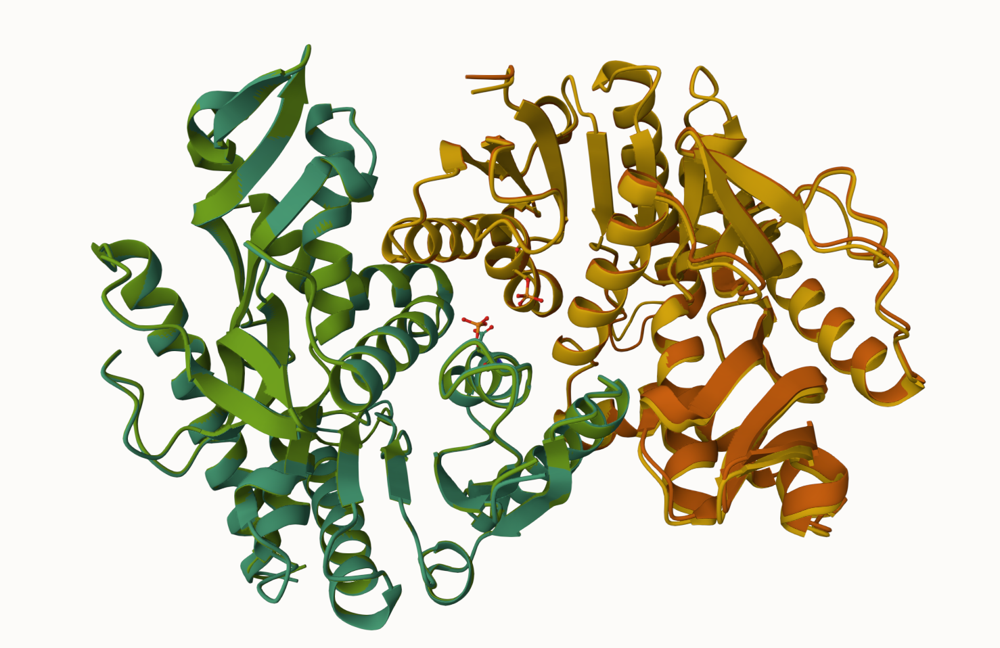
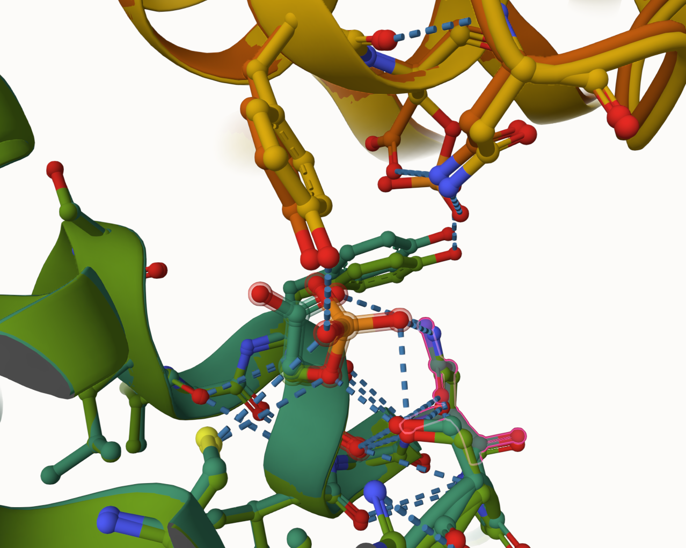

# Homo sapiens MDH1

# Uniprot ID: P40925
# Variation: phosphorylation of S23

## Description

This project details the phosphorylation of Serine 23 on human MDH1. No prior research has been found for this specific modification site of Serine 23. It is located on an α-helix. It is positioned near the middle of the protein, close to the other monomer of the dimer. Being so close to the other monomer also means that it is close to its counterpart. It is near the NAD+/NADH substrate binding sites of 11-17, GAAGQIA; however, it is unlikely that the binding site is affected by the modification. The modification site is not close to the active site, likely having no effect on its function. The unmodified state does not form any weak interactions. The modified state contains a phosphoserine interacting with many amino acids. The mimic variant consists of an aspartic acid hydrogen bonding to asparagine 26.

1. image of the unmodified site

2. image of modification site

3. image of the original site S23 (unmodified)

4. image of PTM site

5. image of mimic variant site

## Effect of the sequence variant and PTM on MDH dynamics

Part 3 from the Project 4 report

1. Image of aligned PDB files OG vs Mimic

3. Image of the site with the aligned PDB files OG vs Mimic

4. Annotated RMSF plot showing differences between the simulations

5. Annotated plots of pKa for the key amino acids

6. If needed, show ligand bound images and how modification affects substrate binding

Description of the data and changes

## Comparison of the mimic and the authentic PTM
  The RMSD between the PTM model and the mimic variant was 0.37 Å. There are no major structural or functional differences besides the additional hydrogen bonds that the PTM possesses. The additional hydrogen bonds may affect the way the enzyme unfolds or folds under varying pressures or temperatures but it does not seem to have any effect on the enzyme's ability to convert malate into oxaloacetate. The mimic is a good approximation of the PTM as it has similar hydrogen bonds and does not affect the active site or any binding sites.

Alignment of PTM and mimic variant model. RMSD value of 0.37.

Alignment of PTM and mimic variant at the modification site, amino acid 23.

### Colab notebook links
Provide file names of completed colab notebooks

Step 1:
[Mimic_MD_simulation_Step1.ipynb](data/colab_1/Mimic_MD_simulation_Step1.ipynb),
[hMDH1_MD_simulation_Step1.ipynb](data/colab_1/hMDH1_MD_simulation_Step1.ipynb)

Step 2:
[Mimic_mdanalysis_colab_Step2.ipynb](data/colab_2/Mimic_mdanalysis_colab_Step2.ipynb),
[hMDH1_mdanalysis_colab_Step2.ipynb](data/colab_2/hMDH1_mdanalysis_colab_Step2.ipynb)

## Authors

Michael T. Holgate

## Deposition Date

## License

Shield: [![CC BY-NC 4.0][cc-by-nc-shield]][cc-by-nc]

This work is licensed under a
[Creative Commons Attribution-NonCommercial 4.0 International License][cc-by-nc].

[![CC BY-NC 4.0][cc-by-nc-image]][cc-by-nc]

[cc-by-nc]: https://creativecommons.org/licenses/by-nc/4.0/
[cc-by-nc-image]: https://licensebuttons.net/l/by-nc/4.0/88x31.png
[cc-by-nc-shield]: https://img.shields.io/badge/License-CC%20BY--NC%204.0-lightgrey.svg

## References

* Citation1 

* Citation2 
