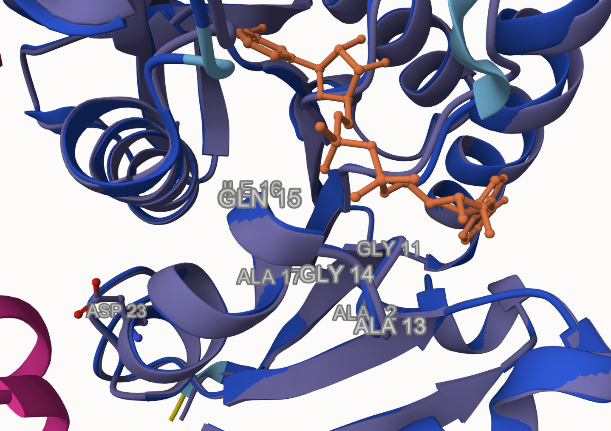

# Homo sapiens MDH1

# Uniprot ID: P40925
# Variation: phosphorylation of S23

## Description

This project details the phosphorylation of Serine 23 on human MDH1. No prior research has been found for this specific modification site of Serine 23. Examining the publications on the UniProt database for MDH1, no specific mention of phosphorylation of S23 is mentioned. One online abstract from the University of San Diego writes about the phosphorylation of S108D, S236D, and S328D. The abstract revealed a 200-fold decrease in enzyme function with a mimic at S108D and a 2-fold decrease in function at S236D and S328D (1). Another abstract reveals that some phospho-modifications can cause an increase in activity. S42D showed a 2.5-fold increase in activity (2). Reading these abstracts, it is clear that phosphorylation of serines in MDH1 can affect the enzyme function. The goal of this project is to analyze the effect of phosphorylation of Serine 23. 
Serine 23 is located on an α-helix. It is positioned near the middle of the protein, close to the other monomer of the dimer. Being so close to the other monomer also means that it is close to its counterpart. It is near the NAD+/NADH substrate binding sites of 11-17, GAAGQIA; however, it is unlikely that the binding site is affected by the modification. The modification site is not close to the active site, likely having no effect on its function. The unmodified state does not form any weak interactions. The modified state contains a phosphoserine interacting with many amino acids.  The mimic variant consists of an aspartic acid hydrogen bonding to asparagine 26.

1. image of the unmodified site

2. image of modification site

3. image of the original site S23 (unmodified)

4. image of PTM site

5. image of mimic variant site

## Effect of the sequence variant and PTM on MDH dynamics

Part 3 from the Project 4 report

1. Image of aligned PDB files OG vs Mimic

3. Image of the site with the aligned PDB files OG vs Mimic

4. Annotated RMSF plot showing differences between the simulations

5. Annotated plots of pKa for the key amino acids

6. If needed, show ligand bound images and how modification affects substrate binding

# Description of the data and changes
After molecular dynamics simulations of the original hMDH1 and the mimic variant, slight differences were found—first, a change in visible bonding in the mimic variant. Pre-simulation, Asp 23 only had one hydrogen bond to Asn 26. Post-simulation, Asp showed three hydrogen bonds, one to Asn 26, one to Tyr 22, and one to Cys 251. An analysis of the original model after simulations shows a hydrogen bond to Ser 19 that was previously not shown . RMSF is the measure of how much an amino acid moves/fluctuates. A comparison of the RMSF plots between the original and mimic shows one major difference in the ~325 range. The rest of the data at key sites is similar. No major differences were found at the modified site, active site, or certain substrate binding sites. RMSD is the measure of how the trajectory changes from start to end. Comparing the two RMSD plots, they equilibrate around the same speed but there are slight differences in the values. This may be because of many reasons, one of them being the mimic variant undergoes fewer functions than the original causing it to stay more still. A comparison of pKa values of substrate binding sites Arg 92 and Arg 162 shows little differences, meaning it is relatively unaffected by the change. RMSD pairwise plots compare frames with themselves in order to create a heat map of RMSD values. Areas of yellow or green indicate higher RMSD values, meaning more movement. Blue areas are more still. Both models have nearly the same amount of blue, yellow, and green. The major difference is where these colors are located. In the original the upper left corner is mainly blue, indicating less movement perhaps at the beginning of a reaction. The mimic variant has yellow/green throughout the plot, indicating a constant movement throughout time. Using all of this data it can be hypothesised that the mimic variant has a slight but noticeable change from the original. However, the function may remain the same regardless of the changes in values.

## Comparison of the mimic and the authentic PTM
  The RMSD between the PTM model and the mimic variant was 0.37 Å. There are no major structural or functional differences besides the additional hydrogen bonds that the PTM possesses. The additional hydrogen bonds may affect the way the enzyme unfolds or folds under varying pressures or temperatures but it does not seem to have any effect on the enzyme's ability to convert malate into oxaloacetate. The mimic is a good approximation of the PTM as it has similar hydrogen bonds and does not affect the active site or any binding sites.

Alignment of PTM and mimic variant model. RMSD value of 0.37.

Alignment of PTM and mimic variant at the modification site, amino acid 23.

### Colab notebook links
Provide file names of completed colab notebooks

Step 1:
[Mimic_MD_simulation_Step1.ipynb](data/colab_1/Mimic_MD_simulation_Step1.ipynb),
[hMDH1_MD_simulation_Step1.ipynb](data/colab_1/hMDH1_MD_simulation_Step1.ipynb)

Step 2:
[Mimic_mdanalysis_colab_Step2.ipynb](data/colab_2/Mimic_mdanalysis_colab_Step2.ipynb),
[hMDH1_mdanalysis_colab_Step2.ipynb](data/colab_2/hMDH1_mdanalysis_colab_Step2.ipynb)

## Authors

Michael T. Holgate

## Deposition Date

## License

Shield: [![CC BY-NC 4.0][cc-by-nc-shield]][cc-by-nc]

This work is licensed under a
[Creative Commons Attribution-NonCommercial 4.0 International License][cc-by-nc].

[![CC BY-NC 4.0][cc-by-nc-image]][cc-by-nc]

[cc-by-nc]: https://creativecommons.org/licenses/by-nc/4.0/
[cc-by-nc-image]: https://licensebuttons.net/l/by-nc/4.0/88x31.png
[cc-by-nc-shield]: https://img.shields.io/badge/License-CC%20BY--NC%204.0-lightgrey.svg

## References

* Narasimhan, S., Kayll, A., Sardelli, A., Berndsen, C., & Provost, J. (2024). Abstract 2038 regulation of cytosolic malate dehydrogenase through phosphorylation: Potential post translational modification regulating mdh catalytic rate and function. Journal of Biological Chemistry, 300(3), 107027. https://doi.org/10.1016/j.jbc.2024.107027 

*  Riley, S., Sardelli, A., Kayll, A., Thompson, C., Berndsen, C., & Provost, J. (2024). Abstract 1712 unveiling key sites and functional impact of putative phosphorylation on human cytosolic malate dehydrogenase. Journal of Biological Chemistry, 300(3), 106960. https://doi.org/10.1016/j.jbc.2024.106960 
